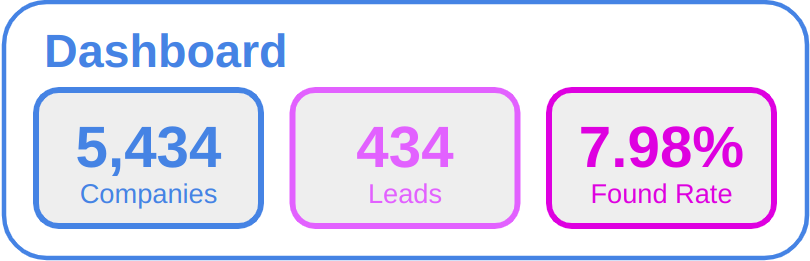
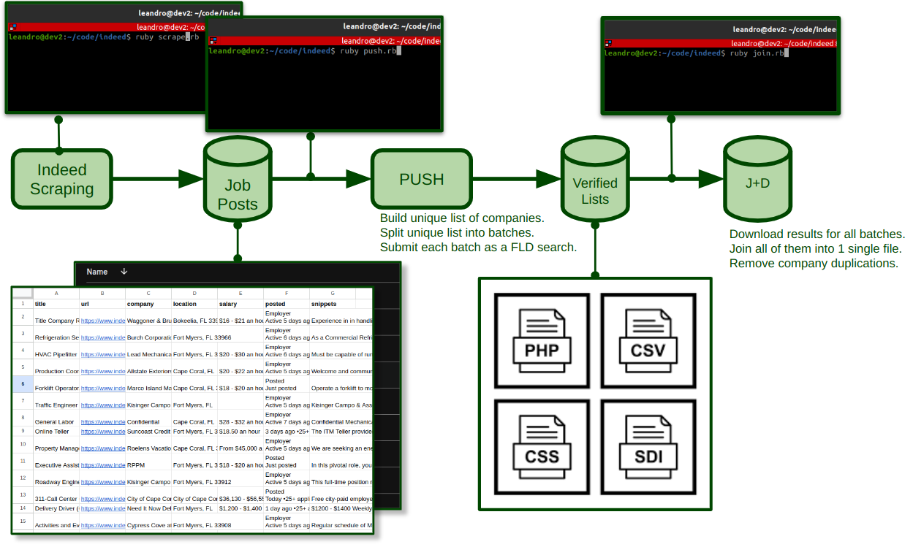

**THIS PROJECT IS UNDER CONSTRUCTION**

# indeed-scraper

[FreeLeadsData](https://freeleadsdata.com) Extensions to Scrape Indeed Searches and Push Results to [FreeLeadsData.com](https://freeleadsdata.com)

**Dashboard:**



**Workflow:**



**Outline:**

1. [Setup Environment](#1-setup-environment)
2. [Installation](#2-installation)
3. [Indeed Scraping](#3-indeed-scraping)
4. [Results Submission](#4-results-submission)
5. [Enrichment Curation](#5-enrichment-curation)


## 1. Setup Environment

MySaaS has been developed and tested on the following environment:
- Ubuntu 20.04
- Ruby 3.1.2
- Bundler 2.3.7

The command below install such an environment in your computer.

```bash
wget https://raw.githubusercontent.com/leandrosardi/my.saas/main/cli/install.sh
bash --login install.sh
```

**Note:** In the code above, you need the `--login` parameter for running RVM and Ruby, as is explained [here](https://stackoverflow.com/questions/9336596/rvm-installation-not-working-rvm-is-not-a-function).


Additionally to the environment, you need **Chrome** and **ChromeDriver** for running the scraper. Use the installer of our [Bots library](https://github.com/leandrosardi/bots).


```bash
wget https://raw.githubusercontent.com/leandrosardi/bots/main/install.sh
bash --login install.sh
```

## 2. Installation

Clone this project.

```bash
mkdir -p ~/code
cd code
git clone https://github.com/freeleadsdata/indeed-scraper
```

Install required gems.

```bash
cd ~/code/indeed-scraper
bundler update
```

## 3. Indeed Scraping

First, create a text file with all the Indeed URLs you want to scrape.

```bash
nano ~/code/indeed-scraper/urls/florida.txt
```

Second, run the scraping.

```bash
cd ~/code/indeed-scraper
ruby scrape.rb tag=florida
```

Finally, and after the scraping is done, find the CSV file.

```bash
cd ~/code/indeed-scraper
ls ./csv/florida.csv
```

## 4. Results Submission

In the `csv` folder of this project you place all the CSV files scraped in the previous section.

The process of setting up **FreeLeadsData** searches for enrich your list of companies is this:

```bash
cd ~/code/indeed-scraper
ruby push.rb tag=florida
```

Such a command does the following:

- Creates list of unique companies
- Split the list in batches of `N` results each one.
- Submits one FreeLeadsData search for each batch.

## 5. Enrichment Curation

Since you splitted the list of companies in the previous section, you have to download the many **result-files** from **FreeLeadsData** and join the results.

```bash
cd ~/code/indeed-scraper
ruby join.rb tag=florida
```

Such a command does the following:

- download the many **result-files** from **FreeLeadsData**.
- join all the results into one single file.
- remove duplications of (job position, company names) in the new file.
- append the job position listed in indeed (if there are many, choosing the first one).
